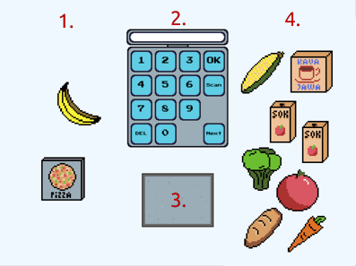

# Poradnik
Czyli instrukcja jak grać w grę. 

  
*__(img.1)__ Ekran głównej rozgrywki z podpisanymi elementami*

Prosty filmik pokazujący rozgrywkę:

# Kasa fiskalna
Kasa fiskalna jest zaznaczona na *(img.1)* numerem **2** i jest najważniejszym elementem gry. Na niej
Wprowadza się wszystkie dane. 

Pod kasą fiskalną znajduje się skaner (numer **3** na *(img.1)*).  
**Uwaga** wykrywanie skanera jest trochę większe niż jego textura (ze względu na nie dokładne
kolizje przedmiotów) więc uważaj by nie trzymać niepożądanych produktów blisko skanera.

Opis przycisków:
- <kbd>Numery od 0 do 9</kbd> - służą do wprowadzania liczby na ekran 
- <kbd>DEL</kbd> - Czyści ekran
- <kbd>Next</kbd> - woła następnego klienta
- <kbd>Scan</kbd> - Skanuje produkt na skanerze
- <kbd>OK</kbd> -  Zatwierdza skan

## Przestrzeń gry
Ekran jest podzielony na 3 obszary:
- Lewa strona: Pusty obszar (numer **1** na *(img.1)*)
- Środek: Kasa oraz skaner (numer **2** i **3** na *(img.1)*)
- Prawa strona: obszar klienta (numer **4** na *(img.1)*)

Na prawej stronie pojawiają się produkty klienta. Gdy lewa strona zawsze pozostaje pusta, dlatego
dobrą praktyką jest przenoszenie wszystkich skasowanych produktów na lewą stronę by nie musieć
pamiętać co zostało skasowane a co nie.

Skaner reaguje na wszystko co na nim leży niezależnie od tego czy przedmioty się przesłaniają, dlatego
należy uważać by nie zostawić produktów już zeskanowanych na nim (lub blisko niego).

## Rodzaje produktów
Jednym z najważniejszych elementów gry jest podział produktów na 2 typy: **na sztuki** oraz **na wagę**.

 Na wagę | Ikona | . | Na sztuki | Ikona
 --------: | :--- | --- | ---: | :--- |
 Banan     | ![Banana-img][Banana]     | . | Chleb     | ![Chleb-img][Bread]      
 Brokuł    | ![Broccoli-img][Broccoli] | . | Ciasto    | ![Cake-img][Cake]        
 Cebula    | ![Onion-img][Onion]       | . | Kava Jawa | ![kavaJava-img][KavaJawa]
 Jabłko    | ![Apple-img][Apple]       | . | Lipzon    | ![Lipzon-img][Lipzon]    
 Kukurydza | ![Corn-img][Corn]         | . | Pepti     | ![Pepti-img][Pepti]      
 Marchew   | ![Carrot-img][Carrot]     | . | Pizza     | ![Pizza-img][Pizza]      
 Wiśnia    | ![Cherry-img][Cherry]     | . | Sok       | ![Juice-img][Juice]      
 Ziemniak  | ![Potato-img][Potato]     | . |           |                          

## Sterowanie
Kasę fiskalną obsługuje się klikając na przyciski.
 
Produkty można przesuwać dokładnie tak samo jak przesuwa się elementy drag'n'drop (np. ikony pulpitu).
Polega to na najechaniu kursorem na produkt, naciśniecie i przytrzymanie pierwszego (lewego) przycisku
myszy, przeciągnięcie kursora (przedmiot będzie za nim podążać) oraz puszczenie przycisku myszy gry
chcemy zostawić przedmiot. 

Skaner reaguje na przedmioty które na nim leżą (lub są bardzo blisko niego)

## Rozgrywka
Gra zaczyna się od kliknięcia przycisku <kbd>Next</kbd>. Zestaw losowych przedmiotów zostanie
wygenerowany i wyświetlony po prawej stronie. Każdy produkt musi zostać zeskanowany (przycisk
<kbd>Scan</kbd>) i zatwierdzony (przycisk <kbd>OK</kbd>).

Scan produktu zadziała tylko gdy ten znajduje sie na **Skanerze**. Ale zależnie od typu produktu
(na sztuki/wagę) procedura skanowania jest inna.

Przegrana następuje gdy zeskanujemy więcej produktu niż faktycznie jest lub zawołamy następnego klienta
(przycisk <kbd>Next</kbd>) bez skanowania wszystkich produktów.

Celem gry jest uzyskanie jak najlepszego czasu i największej ilości klientów bez pomyłki. 

### Przedmioty na sztuki
Przedmioty na sztuki muszą być skanowane pojedynczo - tylko jeden przedmiot może być na skanerze.

Przed kliknięciem przycisku <kbd>Skan</kbd> musi zostać wprowadzona ilość produktu który jest
skanowany. Można zawsze wpisywać `1` ale jeżeli jakiegoś produktu jest więcej można przeciągnąć
dokładnie jeden z nich na skaner, wpisać jego ilość (np. `4`) i nacisnąć <kbd>Scan</kbd>.
Podana ilość skanowanego produktu zostanie zatwierdzona, nie ma znaczenia który liczy się tylko jaki, 
np. ![Chleb][Bread].

Nie jest wymagane wprowadzenie wszystkich za jednym skanem, ale **nie można wprowadzić więcej**.

### Przedmioty na wagę
Przedmioty na wagę mogą być skanowane kilka na raz (ale tego samego rodzaju, np. ![Ziemniak][Potato])

Przed kliknięciem <kbd>Scan</kbd> należy wyczyścić ekran, ponieważ przycisk ten nie czyści ekranu.
Skan produktów na wagę odbywa się automatycznie, to oznacza że nie trzeba podawać ilości produktu oraz
można skanować produkty pojedynczo jak i kilka na raz. Jeżeli masz np. 2x ![marchew][Carrot] możesz
obie położyć na skaner i kliknąć <kbd>Scan</kbd> by zeskanować obie na raz. 

Oczywiście skan musi być zatwierdzony przyciskiem <kbd>OK</kbd>

[Bread]: res/Products/bread.png
[Cake]: res/Products/cake.png
[Juice]: res/Products/juice.png
[KavaJawa]: res/Products/kava_jawa.png
[Lipzon]: res/Products/lipzon.png
[Pepti]: res/Products/pepti.png
[Pizza]: res/Products/pizza.png

[Apple]: res/Products/apple.png
[Banana]: res/Products/banana.png
[Broccoli]: res/Products/broccoli.png
[Carrot]: res/Products/carrot.png
[Cherry]: res/Products/cherry.png
[Corn]: res/Products/corn.png
[Onion]: res/Products/onion.png
[Potato]: res/Products/potato.png